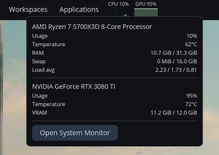

# galaxy-systrkr

Lightweight native [COSMIC](https://system76.com/cosmic) panel applet that shows live CPU and GPU usage as filled-area sparklines, plus a popup with system details.



## Features

- Live CPU and GPU sparklines in the panel — at 0.5 s, 1 s, 2 s, or 5 s tick (configurable)
- Threshold-aware coloring: accent → amber → red as load crosses your warning and critical thresholds
- Per-process drilldown popup: top 5 by CPU%, top 5 by GPU memory or busy% (NVIDIA NVML or DRM fdinfo)
- Auto-detects NVIDIA, AMD, and Intel GPUs; multi-GPU picker for workstations
- Optional RAM, Network, and Disk sparklines (toggle in Settings)
- Adapts to vertical panels (left/right edge): stacks sparklines vertically
- Native COSMIC theming — follows your accent color and light/dark mode
- Live-reload settings via `cosmic-config`

## Requirements

- Rust 1.78+ (2024 edition)
- COSMIC desktop
- For NVIDIA GPU support: NVIDIA driver with NVML library installed

## Install

```bash
just install
```

Then add the applet via `cosmic-settings → Panel → Configure panel applets`.

To install without NVIDIA support (e.g., on AMD-only systems):

```bash
cargo build --release --no-default-features
just install
```

## Uninstall

```bash
just uninstall
```

## Development

```bash
just check    # cargo check
just test     # cargo test
just clippy   # lints
just run      # run the applet standalone for sanity-checking
```

## License

MIT
